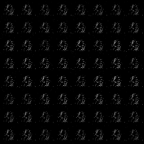

# DCGAN-PyTorch

## Overview

This repository contains an op-for-op PyTorch reimplementation of [Unsupervised Representation Learning with Deep Convolutional Generative Adversarial Networks](https://arxiv.org/pdf/1511.06434.pdf)
.

### Table of contents

- [DCGAN-PyTorch](#dcgan-pytorch)
    - [Overview](#overview)
        - [Table of contents](#table-of-contents)
        - [Download weights](#download-weights)
        - [Test](#test)
        - [Train](#train)
        - [Contributing](#contributing)
        - [Credit](#credit)
            - [Unsupervised Representation Learning with Deep Convolutional Generative Adversarial Networks](#unsupervised-representation-learning-with-deep-convolutional-generative-adversarial-networks)

### Download weights

- [Google Driver](https://drive.google.com/file/d/1rt0iZbWXTZBCh97x3eK_lbTLshnw9Tqp/view?usp=sharing)
- [Baidu Driver](https://pan.baidu.com/s/1uMHRV3loc3FPk6NegWSj4Q) access:`llot`

### Test

Modify the contents of the file as follows.

1. `config.py` line 35 `mode="train"` change to `model="valid"`;
2. `config.py` line 83 `model_path=f"results/{exp_name}/g-last.pth"` change to `model_path=f"<YOUR-WEIGHTS-PATH>.pth"`;
3. Run `python validate.py`.

<span align="center"></span>

### Train

Modify the contents of the file as follows.

1. `config.py` line 35 `mode="valid"` change to `model="train"`;
2. Run `python train.py`.

If you want to load weights that you've trained before, modify the contents of the file as follows.

1. `config.py` line 35 `mode="valid"` change to `model="train"`;
2. `config.py` line 52 `start_epoch=0` change to `start_epoch=XXX`;
3. `config.py` line 53 `resume=False` change to `resume=True`;
4. `config.py` line 54 `resume_d_weight=""` change to `resume_d_weight=<YOUR-RESUME-D-WIGHTS-PATH>`;
5. `config.py` line 55 `resume_g_weight=""` change to `resume_g_weight=<YOUR-RESUME-G-WIGHTS-PATH>`;
6. Run `python train.py`.

### Contributing

If you find a bug, create a GitHub issue, or even better, submit a pull request. Similarly, if you have questions,
simply post them as GitHub issues.

I look forward to seeing what the community does with these models!

### Credit

#### Unsupervised Representation Learning with Deep Convolutional Generative Adversarial Networks

*Alec Radford, Luke Metz, Soumith Chintala*

**Abstract** <br>
In recent years, supervised learning with convolutional networks (CNNs) has seen huge adoption in computer vision
applications. Comparatively, unsupervised learning with CNNs has received less attention. In this work we hope to help
bridge the gap between the success of CNNs for supervised learning and unsupervised learning. We introduce a class of
CNNs called deep convolutional generative adversarial networks (DCGANs), that have certain architectural constraints,
and demonstrate that they are a strong candidate for unsupervised learning. Training on various image datasets, we show
convincing evidence that our deep convolutional adversarial pair learns a hierarchy of representations from object parts
to scenes in both the generator and discriminator. Additionally, we use the learned features for novel tasks -
demonstrating their applicability as general image representations.

[[Paper]](https://arxiv.org/pdf/1511.06434.pdf)

```bibtex
@article{adversarial,
  title={Unsupervised Representation Learning with Deep Convolutional Generative Adversarial Networks},
  author={Alec Radford, Luke Metz, Soumith Chintala},
  journal={arXiv},
  year={2015}
}
```
